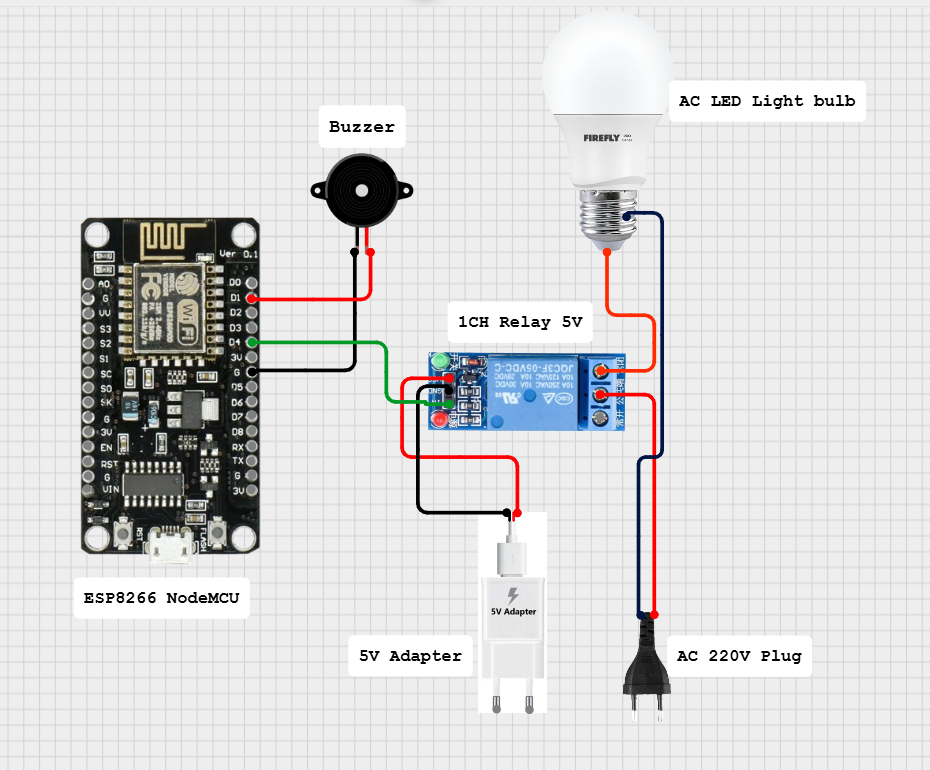

# Simple Home Automation System

## Video Demonstration

Check out the live demo:  
[Video Demonstration](https://vt.tiktok.com/ZSSgSRsGT/) 

---

## Description

This project demonstrates a **simple web-based control panel** using an **ESP8266 or ESP32**.  
It lets you wirelessly turn a **relay module ON or OFF** using a browser, no internet needed!

---

## How It Works

- The ESP8266/ESP32 creates a **Wi-Fi Access Point** with a custom SSID and password.
- A simple **web server** runs on port 80.
- The server displays an HTML interface with **ON/OFF buttons**.
- Clicking a button sends a **GET request** to toggle GPIO12 (D4 on ESP8266).
---

## 🔌 Wiring Guide

| Component         | ESP8266 Pin | GPIO | Description               |
|------------------|-------------|------|---------------------------|
| Relay IN         | D4          | 2    | Controls device ON/OFF    |
| Relay VCC        | 5V          | —    | Power supply              |
| Relay GND        | GND         | —    | Common ground             |

⚠️ Use the **NO (Normally Open)** terminal of the relay for correct operation.

---

## Schematic Diagram

> **Schematic Diagram Screenshot**

---

## Getting Started

### Requirements

- ESP8266 NodeMCU or ESP32
- 1× Relay Module
- Jumper wires, USB cable

### Setup Steps

1. **Connect the components** as per the schematic above.
2. **Upload the Arduino code** using the Arduino IDE.
   - Use the correct board (ESP8266 or ESP32).
   - Install the required libraries.
3. **Connect to the Wi-Fi Access Point** created by the device:
   - **SSID:** `HOME AUTOMATION_AP`
4. Open your browser and go to `192.168.4.1`.
5. Use the web interface to toggle the relay.

---

## License

This project is licensed under the **MIT License**.  
See the [LICENSE](LICENSE) file for details.

---

## 🙋‍♂️ Author
Created by **Roy Cuadra**  
